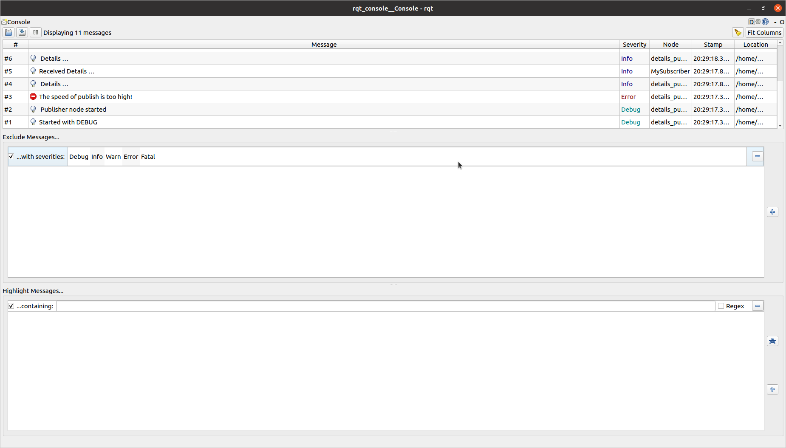

# beginner_tutorials
## ros_pub_sub
---

## Dependencies
- C++ 
- CMake
- Ros 2 Humble


## Steps to run the week10_hw publisher and subscriber
```
Navigate to the ros2 workspace
cd ros2_ws/src
git clone https://github.com/koundinyavinnakota/beginner_tutorials.git
cd ..
colcon build --packages-select week10_hw
. install/setup.bash
ros2 run week10_hw publish_details

Open new terminal, navigate to ros2 workspace
. install/setup.bash
ros2 run week10_hw subscribe_details
```

## Steps to run the week10_hw from launch file
```
Navigate to the ros2 workspace
cd ros2_ws/src
git clone https://github.com/koundinyavinnakota/beginner_tutorials.git
cd ..
colcon build --packages-select week10_hw launch.py
. install/setup.bash

```
## Steps to use service call
After building the project ...
Open new terminal, navigate to ros2 workspace
```
. install/setup.bash
ros2 service call /change_details week10_hw/srv/Details "{first_name: 'Elon',last_name: 'Musk',age: 69}"
```

## Steps to pass parameters from command line
After building the project ...
```
. install/setup.bash
ros2 launch week10_hw launch.py publish_interval:=750
```

## RQT Console Screenshot 


## Key Points to remember
```
- To end the node process " Ctrl + C "
```
