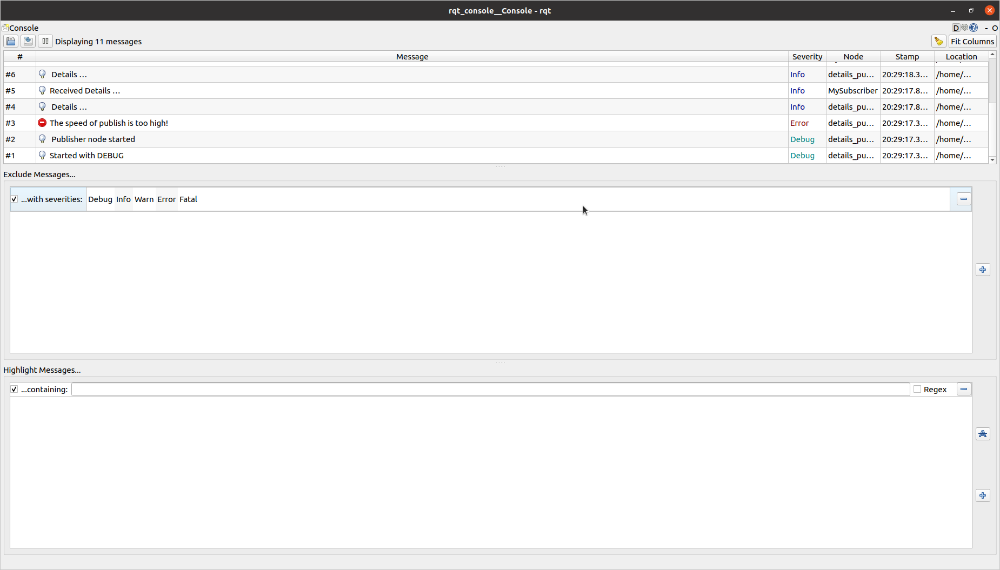

# beginner_tutorials
## beginner_tutorials
---

## Dependencies
- C++ 
- CMake
- Ros 2 Humble


## Steps to run the beginner_tutorials publisher and subscriber
```
Navigate to the ros2 workspace
cd ros2_ws/src
git clone https://github.com/koundinyavinnakota/beginner_tutorials.git
cd ..
colcon build --packages-select beginner_tutorials
. install/setup.bash
ros2 run beginner_tutorials publish_details

Open new terminal, navigate to ros2 workspace
. install/setup.bash
ros2 run beginner_tutorials subscribe_details
```

## Steps to run the beginner_tutorials from launch file
```
Navigate to the ros2 workspace
cd ros2_ws/src
git clone https://github.com/koundinyavinnakota/beginner_tutorials.git
cd ..
colcon build --packages-select beginner_tutorials launch.py
. install/setup.bash

```
## Steps to run the ros bag command

In a new terminal source humble and your package. Then type the following command while publisher or any launch file is running.

For your reference a sample rosbag has been installed in the results folder
```
ros2 bag record --all -o package_output

```
## Steps to use service call
After building the project ...
Open new terminal, navigate to ros2 workspace
```
. install/setup.bash
ros2 service call /change_details beginner_tutorials/srv/Details "{first_name: 'Elon',last_name: 'Musk',age: 69}"
```

## Steps to pass parameters from command line
After building the project ...
```
. install/setup.bash
ros2 launch beginner_tutorials launch.py publish_interval:=750
```

## RQT Console Screenshot 


## Key Points to remember
```
- To end the node process " Ctrl + C "
```
